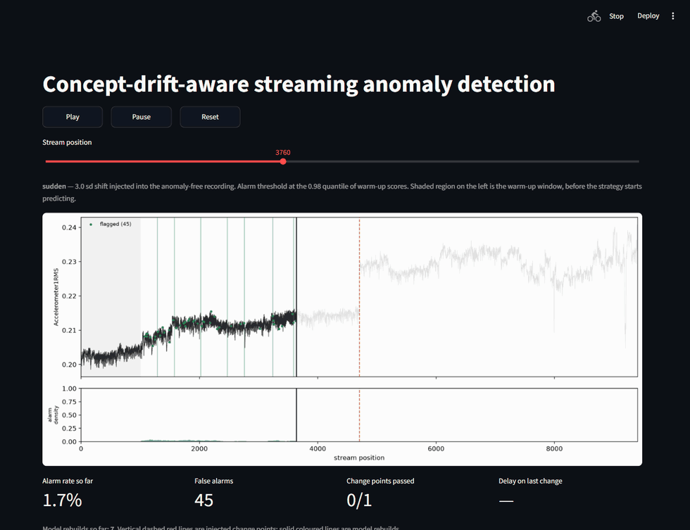
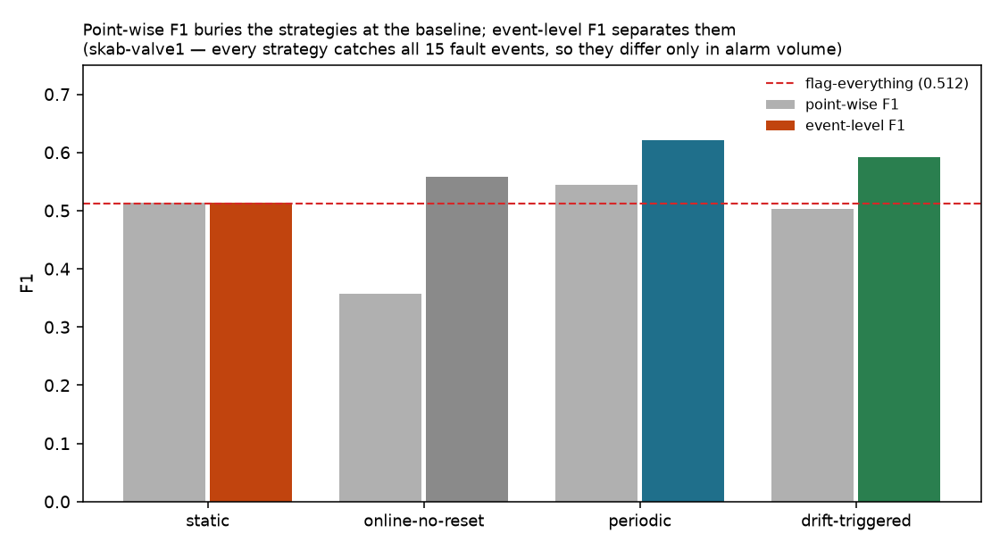

# Concept-Drift-Aware Streaming Anomaly Detector

Anomaly detection for sensor streams whose definition of "normal" keeps moving —
with a live demo showing what each adaptation strategy actually does.



*Real output from the Streamlit dashboard. The stream is replayed left to right;
green dots are flagged points, the dashed red line is an injected change, and the
lower panel is alarm density. The detector notices the change **9 rows** after it
happens, alarms while the model is stale, then settles once it rebuilds.*

## The problem

An anomaly detector trained once on a sensor stream goes wrong in one of two
directions as the process it watches changes.

- **It never updates.** Normal operation shifts, and every reading now looks
  anomalous. On the stream above, a detector fitted once flags **93% of all
  points** — an alarm system nobody will keep listening to.
- **It updates constantly.** The model absorbs the change into its own idea of
  normal within a few hundred rows and goes quiet, flagging **1%**. A fault that
  arrives gradually is learned rather than reported.

Both are easy to build by accident and neither is obvious from a single accuracy
number. The interesting question is not "can we detect anomalies" but **when
should the detector update itself**.

## What this does

Replays a sensor stream through four policies that differ *only* in when the
model is rebuilt, and measures the difference:

| policy | behaviour |
| --- | --- |
| **static** | Isolation Forest fitted once, never updated. The naive baseline. |
| **online-no-reset** | Keeps learning every step, never explicitly rebuilt. A control. |
| **periodic** | Rebuilt on a fixed schedule, whether or not anything changed. |
| **drift-triggered** | Rebuilt only when a drift detector says the input has moved. |

The two controls bracket the problem — one floods, one goes silent — so the
question becomes whether reacting to *detected* change lands anywhere better.

Built on [`river`](https://riverml.xyz) (Half-Space Trees, ADWIN, KSWIN) and
scikit-learn, over [SKAB](https://github.com/waico/SKAB), a labelled industrial
sensor benchmark, with [NAB](https://github.com/numenta/NAB) as a second dataset
used to test whether the calibration transfers.

## Quickstart

```bash
pip install -r requirements.txt
python scripts/download_data.py      # fetches and verifies SKAB
streamlit run app/streamlit_app.py   # the demo
```

The demo reads a small committed file, so it starts instantly and needs no prior
run. To reproduce the numbers below:

```bash
python scripts/run_smoke_test.py     # ~1s, proves the pipeline end to end
python scripts/run_experiment.py     # ~100s, writes results/metrics.csv + figures
python scripts/run_sweep.py          # ~200s, writes results/sweep.csv
python scripts/run_transfer.py       # ~215s, NAB transfer test
python scripts/run_threshold_study.py  # ~495s, threshold rule comparison
```

Tested on Python 3.13. On Windows, launch the app with
`python -m streamlit run app/streamlit_app.py`.

## Results

### Alarm volume when normal shifts

Streams built by injecting a known 3 sd change into SKAB's anomaly-free
recording. These contain no true anomalies, so **every flag is a false alarm** —
the number to minimise. Delay is how long the drift detector took to react.

| stream | static | online-no-reset | periodic | drift-triggered | detection delay |
| --- | --- | --- | --- | --- | --- |
| sudden | 93.4% | 1.0% | 1.4% | 9.2% | 9 rows |
| incremental | 93.3% | 0.7% | 0.7% | 0.9% | 181 rows |
| gradual | 93.4% | 1.3% | 4.3% | 3.5% | 245 rows |
| recurring | 93.4% | 1.0% | 3.9% | 22.2% | 20 rows |

The static baseline is unusable once the process moves. `drift-triggered` alarms
more than `periodic` on sudden and recurring drift because it deliberately keeps
alarming through the transition until it rebuilds — visible as the spike in the
demo above.

### Anomaly detection quality

On 18,160 rows of labelled SKAB `valve1` recordings, of which 17,160 are scored
after warm-up. 34.4% of those are anomalous. **Read the last column first.**

| policy | F1 | alarm rate | vs flag-everything (0.512) |
| --- | --- | --- | --- |
| static | 0.513 | 99.8% | +0.001 |
| online-no-reset | 0.357 | 29.3% | −0.156 |
| **periodic** | **0.544** | 52.3% | **+0.032** |
| drift-triggered | 0.502 | 50.9% | −0.010 |

At a 34.4% base rate, a detector that flags *every single point* scores F1
**0.512**. The static baseline's 0.513 clears that by 0.001 — which is to say it
flags 99.8% of points and achieves nothing beyond the trivial strategy.
`periodic` is the only policy meaningfully above the line.

**Point-wise F1 is a weak discriminator on this data.** The fault blocks are long
and contiguous (15 events, ~390 rows each), so point-wise *recall* rewards
flagging every row of a block and punishes a detector that flags it sparsely —
even though sparse flagging is exactly what you want operationally. That is why
`online-no-reset` scores 0.357 and looks broken, and why the whole field
collapses onto the baseline.

#### Event-level scoring

Scoring each contiguous fault block as **one event** — recall becomes "was each
fault noticed at all", precision stays point-wise as the volume penalty — pulls
the strategies apart (`src/evaluate.py`, `event_metrics`):

| policy | point-wise F1 | event-level F1 | events caught | vs flag-everything |
| --- | --- | --- | --- | --- |
| static | 0.513 | 0.513 | 15 / 15 | +0.001 |
| online-no-reset | 0.357 | 0.559 | 15 / 15 | +0.046 |
| **periodic** | 0.544 | **0.622** | 15 / 15 | **+0.109** |
| drift-triggered | 0.502 | 0.593 | 15 / 15 | +0.081 |



Two things this reveals that point-wise F1 hid:

- **`online-no-reset` was never broken.** It catches all 15 fault events; its low
  point-wise F1 was purely the sparse-flagging artefact. At event level it clears
  the baseline.
- **`static` is the one policy events do not help** — it flags 99.8% of points, so
  counting blocks once gives it nothing, correctly. It stays at the baseline while
  the three adaptive policies rise above it, `periodic` by the most.

**The honest limit:** every strategy catches every fault event here (event recall
= 1.0 across the board), so on this stream event-level F1 reduces to a
precision-driven ranking — "they all find the faults, they differ only in how many
false alarms they raise". That is the correct operational picture, and it is
exactly the picture point-wise F1 obscured, but the recall axis is uninformative
on `valve1` specifically because the faults are so long. A stream with short,
sparse anomalies is where event recall would carry its own weight.

### How large must a change be to be noticed

From a 60-run sweep (4 shapes x 5 magnitudes x 3 detectors,
`notebooks/kaggle_experiment.ipynb`). Mean detection delay in rows, ADWIN:

| shape | 0.0 (control) | 1.0 sd | 2.0 sd | 3.0 sd | 5.0 sd |
| --- | --- | --- | --- | --- | --- |
| sudden | 393 | 9 | 9 | 9 | 9 |
| incremental | 373 | 277 | 245 | 181 | 117 |
| gradual | 373 | 245 | 245 | 245 | 245 |
| recurring | 201 | 20 | 20 | 20 | 20 |

Sudden and recurring changes are caught almost immediately even at 1 sd.
Incremental drift is the case where magnitude genuinely matters. Gradual drift
resists ADWIN entirely — the delay sits at 245 rows no matter how big the change,
because early in the transition individual rows flip between the old and new
regime, so the signal grows *spiky* before its mean has moved. A location-based
detector cannot see that.

#### A variance detector for the gradual case

`adwin_var` feeds ADWIN the trailing **variance** of the signal instead of its
level, so it reacts to that early spikiness. On gradual drift it does what ADWIN
cannot — the delay finally responds to magnitude:

| shape | detector | 1.0 sd | 2.0 sd | 3.0 sd | 5.0 sd |
| --- | --- | --- | --- | --- | --- |
| gradual | ADWIN | 245 | 245 | 245 | 245 |
| gradual | **adwin_var** | 213 | 117 | **85** | **85** |
| incremental | ADWIN | 277 | 245 | 181 | 117 |
| incremental | **adwin_var** | — | — | — | — |

At 3 sd it catches gradual drift in **85 rows against ADWIN's 245**, and it is
much quieter overall — **0.28 false alarms per 1000 steps against ADWIN's 1.93**
and KSWIN's 2.80, firing just twice on the drift-free control where ADWIN fires
18 times.

The catch, stated plainly: **`adwin_var` is blind to incremental drift** (the
dashes above — zero detections at every magnitude). A smooth ramp shifts the mean
without changing the spread, so a variance detector has nothing to react to. The
mean detector owns the smooth ramp, the variance detector owns the interleaved
gradual case — they are complements.

#### Running both: `adwin_meanvar`

The obvious move is to run both ADWINs and fire when either does — `adwin_meanvar`.
I expected this to catch every shape but pay for it in false alarms, since it
inherits the union of both detectors' firing. **Measured, that cost barely
appears:**

| detector | shapes caught | gradual @3sd | false alarms / 1k | control firings |
| --- | --- | --- | --- | --- |
| ADWIN | all but gradual¹ | 245 | 1.93 | 18 |
| adwin_var | all but incremental | 85 | **0.28** | **2** |
| **adwin_meanvar** | **all four** | **85** | 1.98 | 18 |

¹ ADWIN "catches" gradual but flat at 245 rows regardless of magnitude.

`adwin_meanvar` detects **24 of 24** change points across the sweep (adwin_var
manages 19 of 24, missing every incremental one), matches ADWIN exactly on
sudden, incremental and recurring, and matches `adwin_var`'s best gradual delay —
in fact beating it at low magnitude (149 vs 213 rows at 1 sd), because its extra
adaptations keep the reference window fresher. And it does this at **1.98 false
alarms per 1000 steps against ADWIN's 1.93**, with the *same* 18 firings on the
drift-free control. The variance branch's false alarms overlap ADWIN's — both
fire on the same real background drift — so the union is essentially ADWIN's rate,
not the sum I had assumed.

So the honest recommendation shifts: **`adwin_meanvar` is the best all-round
detector** — it strictly improves on ADWIN (same everywhere, far better on
gradual) at negligible extra cost. `adwin_var` is still the pick when gradual is
the *only* concern and quiet matters, at 0.28 false alarms per 1000 steps.

### Does the calibration transfer? Mostly not

Everything above was tuned on SKAB, which invites the obvious objection that the
settings are fitted to one industrial rig. [NAB](https://github.com/numenta/NAB)
tests that directly — it is univariate rather than 8 sensors, ~10% anomalous
rather than 35%, and covers server metrics, taxi demand and ambient temperature.
Six series, SKAB's settings applied unchanged, against the same settings retuned
on NAB (`python scripts/run_transfer.py`):

| series | flag-everything | transferred (q=0.98) | retuned | best q | cost |
| --- | --- | --- | --- | --- | --- |
| machine_temperature | 0.189 | **0.528** | 0.528 | 0.98 | 0.000 |
| cpu_utilization_asg | 0.162 | 0.163 | **0.399** | 0.95 | 0.237 |
| ambient_temperature | 0.208 | **0.371** | 0.371 | 0.98 | 0.000 |
| nyc_taxi | 0.200 | 0.112 | 0.230 | 0.50 | 0.118 |
| ec2_request_latency | 0.205 | 0.107 | 0.189 | 0.50 | 0.082 |
| rogue_agent_key_updown | 0.219 | 0.040 | 0.162 | 0.50 | 0.122 |

**Not retuning costs 0.093 F1 on average, and the transferred setting beats
flag-everything on only 3 of 6 series.** The best threshold is bimodal — 0.95–0.98
on three series, 0.50 on the other three — so no single value serves NAB, let
alone both datasets.

Two further results worth stating plainly:

- **Point-wise, on `ec2_request_latency` and `rogue_agent_key_updown`, nothing
  beats flag-everything even after retuning.** Under point-wise F1, those series
  are not solved here — but see the event-level view directly below, which
  reverses this.
- **No strategy wins consistently.** The best performer varies by series across
  all four policies, including the two controls. Whatever advantage the adaptive
  approach shows on SKAB does not reproduce as a general ranking.

#### Event-level scoring reverses the "unsolved" verdict

Scoring each labelled anomaly *window* once, rather than every row (the same
event-level metric used on `valve1`), changes this conclusion materially. NAB's
anomalies are short and sparse, so point-wise recall punishes a detector that
flags a window without also flagging its neighbourhood — which is exactly what
sinks the three series above.

| series | flag-everything | transferred event F1 (q=0.98) | retuned event F1 | beats baseline |
| --- | --- | --- | --- | --- |
| machine_temperature | 0.189 | 0.668 | 0.668 | yes |
| cpu_utilization_asg | 0.162 | 0.285 | 0.444 | yes |
| ambient_temperature | 0.208 | 0.458 | 0.458 | yes |
| nyc_taxi | 0.200 | 0.393 | 0.393 | yes |
| ec2_request_latency | 0.205 | 0.408 | 0.408 | yes |
| rogue_agent_key_updown | 0.219 | 0.282 | 0.282 | yes |

At event level the transferred q=0.98 setting beats flag-everything on **all six
series (point-wise: three)**, and the mean cost of not retuning falls from 0.093
to **0.026 F1**. The three series point-wise scoring called unsolved are all
cleared — they were never unsolvable; point-wise F1 simply could not credit a
correct but sparse detection of a short window.

The same caveat as `valve1` applies. For the *best* strategy on each series event
recall saturates at 1.0, so its event F1 is precision-driven. The recall axis
discriminates between *strategies* instead — at q=0.98 a weaker policy can catch
none of a series' anomaly windows (event recall 0.0) while the best catches all
of them.

So the honest conclusion is that the *method* carries across datasets but the
point-wise *numbers* do not — and that a good part of that gap was the metric,
not the detector: once anomalies are scored as events, the transferred setting
clears the trivial baseline on every series. The threshold still has to be set
from the expected anomaly rate of the specific deployment; that much is not a
property of the approach.

### Deriving the threshold instead of hand-setting it

The obvious fix is to compute the threshold from the warm-up score distribution
rather than picking a quantile per dataset. `src/thresholds.py` implements four
rules and `scripts/run_threshold_study.py` applies each one *unchanged* to all
seven labelled streams, against the hand-tuned per-dataset baseline. Mean lift
over flag-everything, with the strategy held fixed:

| rule | drift-triggered | periodic | online-no-reset | static |
| --- | --- | --- | --- | --- |
| **quantile@0.9** (= target_rate@0.10) | **−0.068** | **−0.070** | **−0.051** | **+0.026** |
| hand-tuned per dataset | −0.100 | −0.075 | −0.061 | −0.023 |
| quantile@0.98 | −0.162 | −0.145 | −0.109 | −0.018 |
| robust_z@3 | −0.220 | −0.233 | −0.236 | −0.013 |
| tukey@3 | −0.236 | −0.241 | −0.236 | −0.146 |

**One uniform quantile beats per-dataset hand tuning on every strategy**, by
+0.005 to +0.049. That is the result worth having: it removes a manual knob and
does slightly better than the knob did.

Three honest caveats, all of which cut against the idea:

- **The robust rule lost.** `robust_z` was written on the theory that the
  binding problem was warm-up contamination, and it *is* measurably more robust
  — a fixed quantile shifts ~81% under 35% contamination, `robust_z` ~34%. But
  only one of seven streams is contaminated at all, so robustness bought nothing
  and cost calibration accuracy. **The hypothesis was wrong.**
- **`target_rate` is a reparameterisation, not a new rule.** `target_rate(r)` is
  exactly `quantile(1 − r)` and gives bit-identical results. It survives because
  its parameter means something to whoever sets it.
- **Every rule still has negative mean lift for the three adaptive strategies.**
  A better threshold narrows the gap to flag-everything; it does not close it.
  Only the static Isolation Forest gets above the line on average.

The recommended setting is exported as `thresholds.RECOMMENDED_RULE`. The main
SKAB experiment deliberately keeps its hand-tuned value — on that one stream the
uniform rule wins by favouring the static baseline while collapsing the adaptive
strategies (0.11 against 0.54 for `periodic`), so adopting it there would make
the headline comparison worse to chase a cross-dataset average.

## Limitations

These are real constraints on what the numbers above can support.

- **SKAB's anomaly-free recording is not stationary.** It has no annotated
  faults, but the process drifts on its own. Running with *no* injected drift
  still produces 18 adaptations, at nearly the same positions as with a 3 sd step
  injected. The injected change adds essentially one detection.
- **Because of that, false-alarm counts are an upper bound**, not a measurement.
  Some are the detector correctly noticing real process change I have no ground
  truth for.
- **Detection *rate* is uninformative on this data** and is deliberately not
  reported as a result. It comes out at 1.0 for every magnitude including the
  zero control, because a firing always lands within the matching horizon of an
  arbitrary point.
- **The labelled stream is concatenated** from 16 separate valve1 recordings to
  get usable length. The joins are genuine regime changes of unknown size, so
  that stream is used for anomaly quality only, never for drift timing.
- **The calibration transfers only partially.** Measured, not assumed — see the
  transfer section above. Point-wise, SKAB's threshold costs 0.093 F1 on average
  on NAB and beats the trivial baseline on only half its series; scored at the
  event level the cost falls to 0.026 and it clears the baseline on all six, so
  much of the apparent transfer failure was the point-wise metric, not the
  detector. A per-deployment threshold is still required either way.
- **Thresholds are calibrated per stream family** (0.98 quantile where anomalies
  are rare, 0.50 where they are a third of the data). That is a deployment-time
  choice, not something the method decides for itself.
- **`drift-triggered` does not win the headline comparison.** `periodic` edges
  it on labelled F1, and both controls beat it on raw alarm volume. Its
  advantage is reacting to change on evidence rather than on a schedule, and
  catching a sudden shift in 9 rows; that is a narrower claim than "adaptive
  detection works better", and it is the one the data supports.

## How it works

The online model is `river`'s Half-Space Trees. Two details matter:

**Feature ranges and thresholds are fixed at warm-up, not rolling.** The obvious
build uses a `MinMaxScaler` and a rolling quantile threshold, but both adapt
continuously and would absorb the drift before the model ever saw it — hiding
the exact effect being measured. Instead both are taken from the warm-up window
and held; adaptation means re-running warm-up, which rebuilds model, ranges and
threshold together.

**The drift detector watches the input, not the model's anomaly score.** Watching
the score is self-defeating: a learning model accommodates the shift, so its
score distribution never moves and the detector never fires. It monitors mean
absolute z-score of the sensors against the window the model was last built on.

## Layout

```
src/           data_loader (SKAB + NAB), drift_injection, models, detectors,
               thresholds, evaluate, experiment, sweep
app/           streamlit_app.py
scripts/       download_data, run_smoke_test, run_experiment, run_tuning,
               run_sweep, run_transfer, GIF export
notebooks/     kaggle_experiment.ipynb
results/       metrics.csv, sweep.csv, tuning.csv, transfer.csv,
               threshold_study.csv, figures/, demo.gif
tests/         100 tests
```

`results/demo.gif` is a screen capture of the running dashboard.
`results/demo_animation.gif` shows all four strategies together and regenerates
from committed data with `python scripts/export_demo_gif.py` — no browser needed.

Development log, including the design mistakes found by running the code, is in
[PROGRESS.md](PROGRESS.md).
